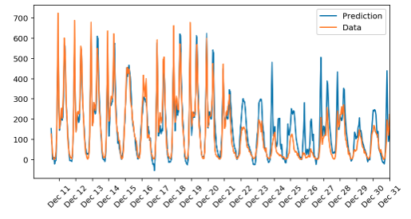

# Predict bike-sharing patterns

## Table of Contents

1. [Project Overview](#project_overview)
2. [Installation](#installation)
3. [File Descriptions](#files)
4. [Results](#results)
5. [Licensing, Authors, and Acknowledgements](#licensing)

## Project Overview 

In this project, a simple two layer neural network model is built and used to predict daily bike rental ridership.

## Installation 

Required libraries and packages can be find in the [requirement file]('requirement.txt')

## File Descriptions 

### Folders: 
**Bike-Sharing-Dataset:** contains the data files

**assets:** contains the images used in the notebooks

### Files:
**dPredicting_bike_sharing_data.ipynb:** the main notebook contains all the codes

**Predicting_bike_sharing_data.html:** html format of dog_app.ipynb

**my_answers.py:** neural network class

## Results

Using the 2-layer neural network with 24 node hidden layer, 5000 epochs and 0.5 learning rate, the final training MSE loss is 0.056 and the final validation MSE loss is 0.160.
The predicted results are gievn below:

## Licensing, Authors, and Acknowledgements

Acknowledge to [Udacity](https://www.udacity.com/) for providing the stater code.  

